# 🛡️ VMware Home Cybersecurity Lab

A personal cybersecurity home lab built with VMware Workstation for hands-on practice in network security, vulnerability assessment, and ethical hacking.

**Student:** [Your Full Name]  
**Course:** Cybersecurity & Digital Forensics – Edinburgh College  
**Date:** July 2026

---

## 🎯 Project Objective

To build a safe, isolated virtual environment that simulates a small company network. This lab allows me to practice network scanning, system hardening, vulnerability identification, safe ethical hacking, and basic digital forensics.

---

## 🖥️ Lab Architecture

- **Kali Linux** – Attacker / Security tools machine
- **Metasploitable 2** – Intentionally vulnerable target machine
- **Ubuntu-Secure** – Hardened workstation

**Networking:** NAT + Host-only adapters

---

## ✅ Key Activities & Screenshots

### 1. Network Scanning & Reconnaissance
Performed multiple Nmap scans to identify open ports and services.

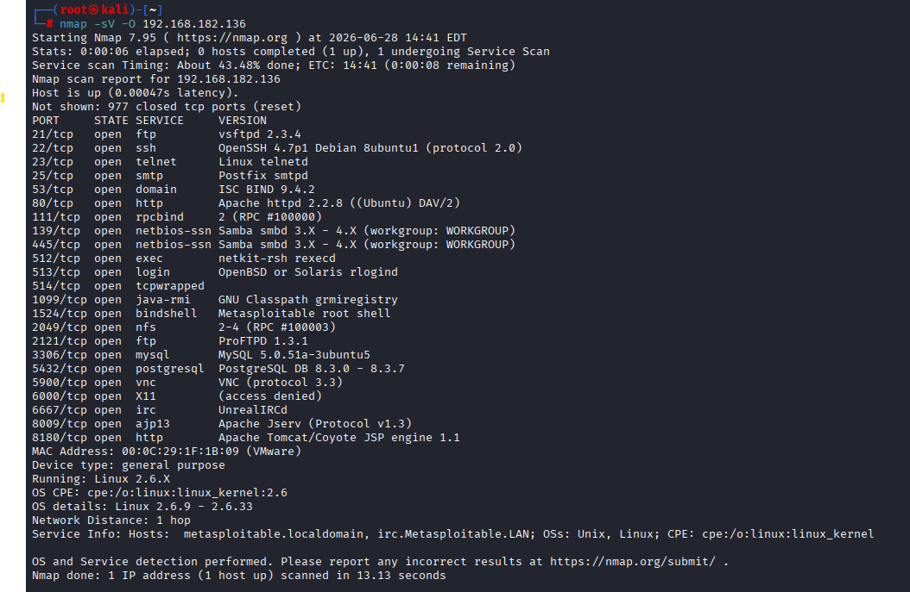
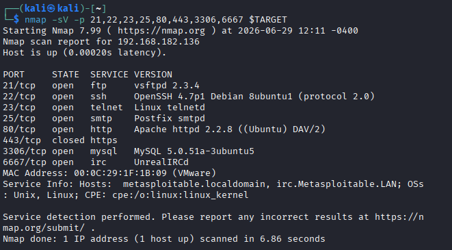
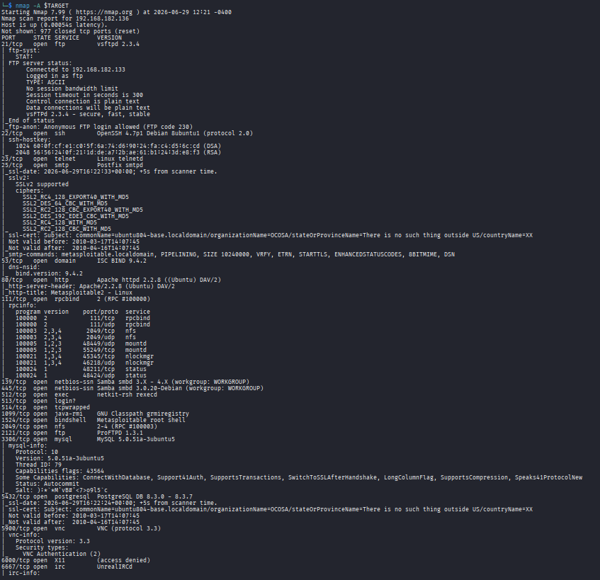
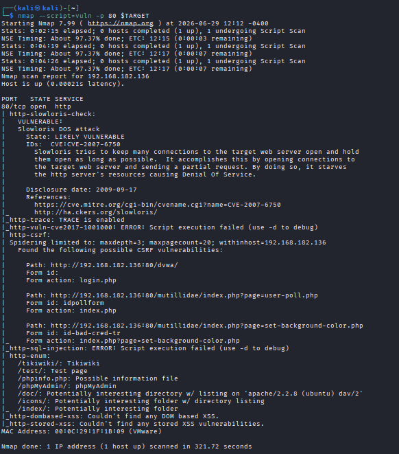

### 2. Vulnerability Identification, Web Access & SQL Injection
Accessed the Metasploitable web interface and vulnerable applications.

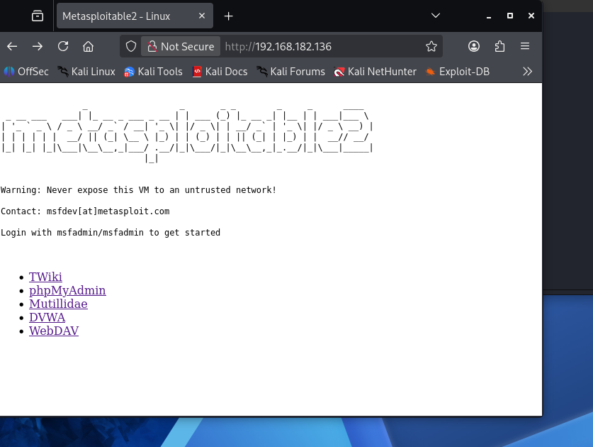
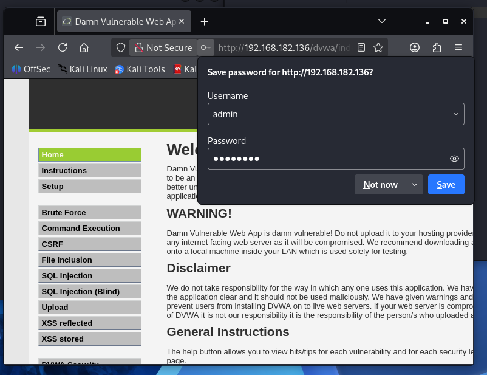
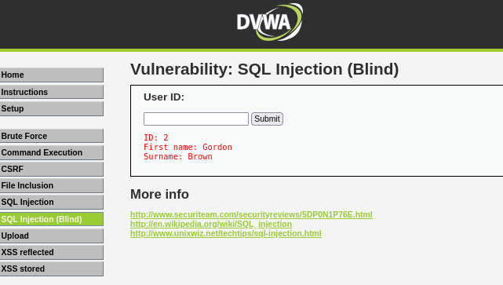

### 3. System Hardening
Enabled UFW firewall on Ubuntu-Secure.

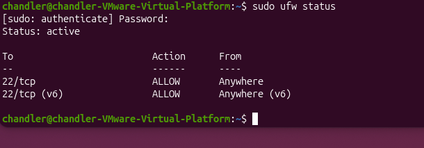

### 4. Safe Ethical Hacking & Forensics
Gained SSH access to Metasploitable. Created, deleted, and attempted to recover sensitive data using `strings` command.

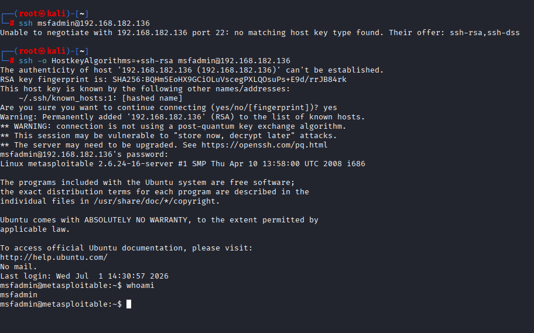
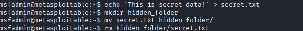
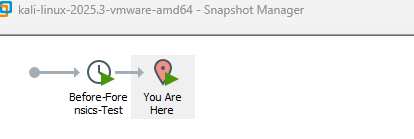
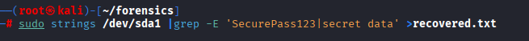

---

## 📚 What I Learned

- The power of reconnaissance with Nmap
- How easily vulnerable systems can be accessed
- Importance of system hardening
- Basic digital forensics concepts and challenges of data recovery

---

## 🚀 Future Improvements

- Advanced exploitation with Metasploit
- Full disk imaging with Autopsy
- SIEM implementation

---

**Last Updated:** July 1, 2026

*All activities performed in an isolated educational lab environment.*
