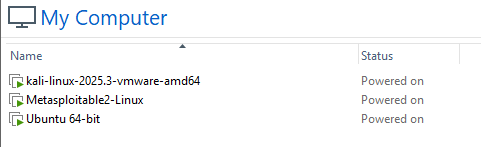

# 🛡️ VMware Home Cybersecurity Lab

A personal cybersecurity home lab built with VMware Workstation for hands-on practice in network security, vulnerability assessment, and ethical hacking.

**Student:** Chandler Yeardly 
**Course:** Cybersecurity & Digital Forensics – Edinburgh College  
**Date:** June 2026

---

## 🎯 Project Objective

To build a safe, isolated virtual environment that simulates a small company network. This lab allows me to practice:

- Network scanning and reconnaissance
- System hardening
- Vulnerability identification
- Safe ethical hacking techniques
- Digital forensics preparation

---

## 🖥️ Lab Architecture

- **Kali Linux** – Attacker / Security tools machine
- **Metasploitable 2** – Intentionally vulnerable target machine
- **Ubuntu-Secure** – Hardened workstation

**Networking:** NAT + Host-only adapters

---

## ✅ Progress & Screenshots

### Lab Setup

### Nmap Scanning & Reconnaissance
  
  
  

### Web Interface Exploration
  

### System Hardening

---

## 🔍 Key Findings

- Multiple services and web applications discovered running on Metasploitable 2
- Several Nmap scans revealed open ports and potential vulnerabilities
- Successfully accessed the web interface from Kali Linux
- Applied basic hardening on Ubuntu-Secure using UFW

---

## 📚 What I Learned

- The effectiveness of different Nmap scan types for reconnaissance
- How vulnerable machines expose multiple services
- The importance of system hardening and firewall configuration
- How to safely explore and document a target environment

---

## 🚀 Next Steps

- Attempt safe logins using default credentials
- Perform basic exploitation exercises
- Start basic digital forensics activities

---

**Last Updated:** June 29, 2026

*All activities performed in an isolated educational lab environment.*
